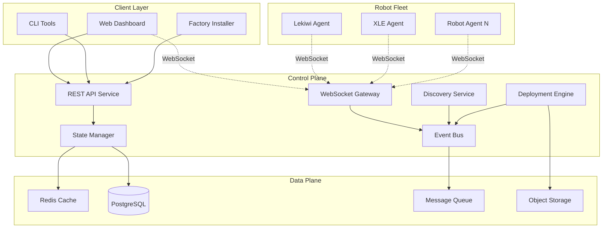
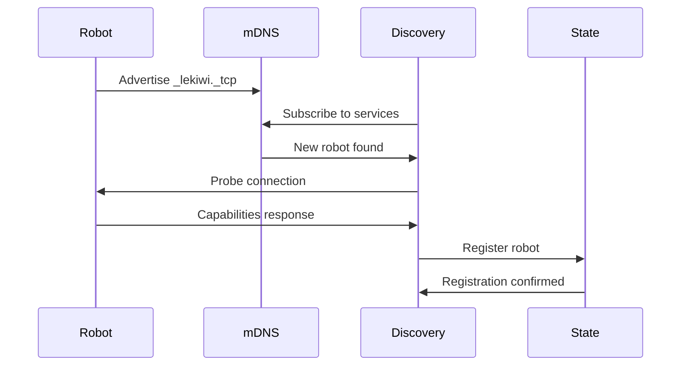
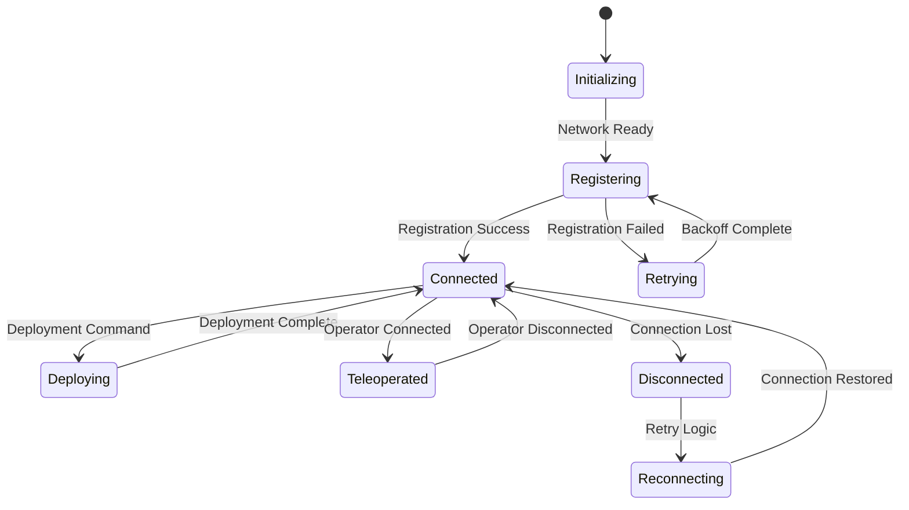
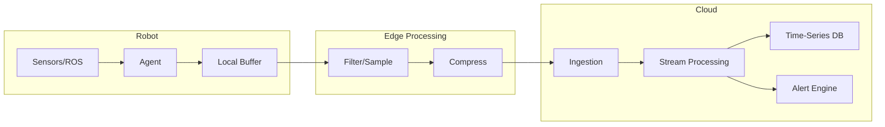
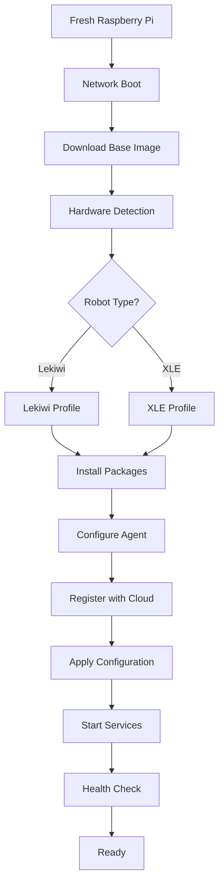
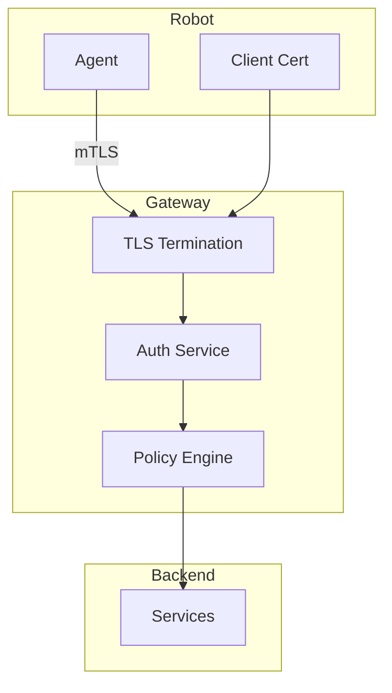
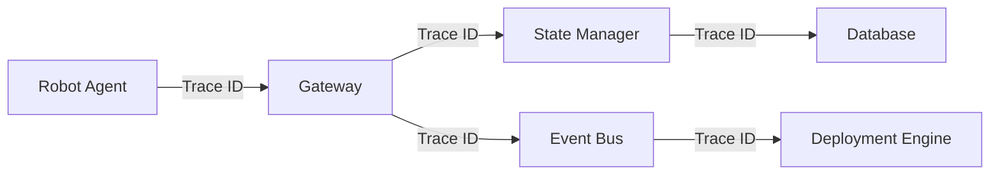

# Lekiwi Heartbeat - Production Architecture Design

## Executive Summary

A production-grade robot deployment and management system designed for elegance, reliability, and minimal overhead. This architecture replaces the current polling-based system with an event-driven, state-managed solution that supports real-time teleoperation monitoring without impacting robot performance.

## System Overview

### Core Design Philosophy
- **Event-Driven Architecture**: WebSocket-based real-time communication replaces polling
- **State Management**: Persistent state with event sourcing for reliability
- **Minimal Robot Overhead**: Lightweight agent with push-based updates
- **Graceful Degradation**: Systems continue functioning even with partial failures
- **Security by Design**: Zero-trust networking with mutual TLS authentication

### High-Level Architecture



## Core Services

### 1. State Manager Service
**Responsibility**: Single source of truth for all robot and deployment state

**Components**:
- Event Store: Immutable log of all state changes
- Snapshot Store: Periodic state snapshots for fast recovery
- Query Engine: CQRS pattern for read optimization

**State Model**:
```yaml
Robot:
  id: uuid
  type: lekiwi|xle
  hardware:
    serial: string
    model: string
    revision: string
  network:
    hostname: string
    mac_address: string
    ip_addresses: []
  status:
    online: boolean
    last_seen: timestamp
    uptime: duration
  deployment:
    os_version: string
    agent_version: string
    installed_packages: []
  teleoperation:
    active: boolean
    operator_id: string
    session_start: timestamp
    video_streams: []
  resources:
    cpu_usage: float
    memory_usage: float
    disk_usage: float
    temperature: float
```

### 2. WebSocket Gateway
**Responsibility**: Real-time bidirectional communication with robots and clients

**Features**:
- Connection pooling with automatic reconnection
- Message routing based on topic subscriptions
- Presence detection with heartbeat monitoring
- Bandwidth-aware message throttling

**Protocol**:
```json
{
  "type": "heartbeat|telemetry|command|response",
  "robot_id": "uuid",
  "timestamp": "iso8601",
  "sequence": 12345,
  "payload": {}
}
```

### 3. Discovery Service
**Responsibility**: Network-based robot discovery and registration

**Mechanisms**:
- mDNS/Avahi for local network discovery
- DHCP snooping for new device detection
- Active scanning with parallel connection attempts
- Cloud-init integration for factory provisioning

**Discovery Flow**:


### 4. Deployment Engine
**Responsibility**: Orchestrate software deployment and updates

**Features**:
- Differential updates (only changed files)
- Atomic deployments with rollback capability
- Parallel deployment with rate limiting
- Pre/post deployment health checks

**Deployment Strategy**:
```yaml
deployment:
  strategy: rolling|blue-green|canary
  batch_size: 5
  health_check:
    timeout: 30s
    retries: 3
  rollback:
    automatic: true
    threshold: 20%
```

### 5. Event Bus
**Responsibility**: Decouple services through asynchronous messaging

**Event Types**:
- Robot lifecycle (connected, disconnected, registered)
- Teleoperation (started, stopped, operator_changed)
- Deployment (initiated, progress, completed, failed)
- System health (resource_alert, temperature_warning)

## Robot Agent Architecture

### Lightweight Agent Design
**Goal**: Minimal resource footprint with maximum observability

**Core Components**:
```
/opt/lekiwi-agent/
├── agent                 # Single binary (Go/Rust)
├── config.yml           # Configuration
├── state/              # Local state cache
└── logs/               # Structured logs
```

**Agent Responsibilities**:
1. **Heartbeat**: Send periodic keep-alive (30s interval)
2. **Telemetry**: Push system metrics on change (debounced)
3. **Command Execution**: Process deployment commands
4. **Service Monitoring**: Watch ROS nodes and key services
5. **Event Streaming**: Push teleoperation events in real-time

**Resource Constraints**:
- Memory: < 50MB resident
- CPU: < 1% average usage
- Network: < 1KB/s average bandwidth

### Agent State Machine


## Data Flow Architecture

### Real-Time Telemetry Pipeline


### Teleoperation Status Detection
**Approach**: Monitor actual usage patterns, not just service state

```python
# Agent teleoperation detector
class TeleoperationMonitor:
    def detect_active_session(self):
        indicators = {
            'joy_commands': self.check_ros_topic('/cmd_vel', threshold=5),
            'video_streams': self.check_network_connections(port=8554),
            'operator_connection': self.check_webrtc_peers(),
            'control_latency': self.measure_command_latency()
        }
        return self.evaluate_indicators(indicators)
```

## Factory Install Process

### Zero-Touch Provisioning
**Goal**: Automated robot provisioning from bare Raspberry Pi

### Installation Flow


### Cloud-Init Configuration
```yaml
#cloud-config
hostname: ${ROBOT_ID}
users:
  - name: lekiwi
    groups: [sudo, dialout, video]
    ssh_authorized_keys: []

write_files:
  - path: /etc/lekiwi/agent.yml
    content: |
      robot_id: ${ROBOT_ID}
      server: wss://heartbeat.lekiwi.com
      auth:
        method: mutual_tls
        cert: /etc/lekiwi/certs/robot.crt
        key: /etc/lekiwi/certs/robot.key

runcmd:
  - curl -fsSL https://deploy.lekiwi.com/install.sh | bash
  - systemctl enable lekiwi-agent
  - systemctl start lekiwi-agent
```

## Real-Time Communication Strategy

### WebSocket Channels
**Design**: Topic-based pub/sub with automatic reconnection

```typescript
// Client subscription example
interface Subscription {
  topics: string[];  // e.g., ["robot.*.heartbeat", "teleoperation.started"]
  filters?: {
    robot_ids?: string[];
    event_types?: string[];
  };
  throttle?: {
    rate: number;  // messages per second
    strategy: 'sample' | 'aggregate' | 'latest';
  };
}
```

### Message Priority Queue
```yaml
priorities:
  critical:  # Emergency stop, safety alerts
    queue: priority_0
    timeout: 100ms
  high:      # Teleoperation commands
    queue: priority_1
    timeout: 500ms
  normal:    # Telemetry, status updates
    queue: priority_2
    timeout: 5s
  low:       # Bulk data, logs
    queue: priority_3
    timeout: 30s
```

## State Management Design

### Event Sourcing Pattern
```typescript
interface Event {
  id: string;
  aggregate_id: string;  // robot_id
  type: string;
  timestamp: Date;
  data: any;
  metadata: {
    user_id?: string;
    correlation_id?: string;
    causation_id?: string;
  };
}

class RobotAggregate {
  apply(event: Event): void {
    switch(event.type) {
      case 'RobotRegistered':
        this.registered = true;
        this.hardware = event.data.hardware;
        break;
      case 'TeleoperationStarted':
        this.teleoperation = {
          active: true,
          operator_id: event.data.operator_id,
          started_at: event.timestamp
        };
        break;
      // ... other events
    }
  }
}
```

### Caching Strategy
**Static Data**: Cached until robot reboot
```yaml
cache_policies:
  hardware_info:
    ttl: until_reboot
    invalidate_on: ['RobotRebooted', 'HardwareChanged']
  
  network_config:
    ttl: 1h
    invalidate_on: ['NetworkConfigChanged']
  
  telemetry:
    ttl: 30s
    strategy: sliding_window
  
  deployment_status:
    ttl: 5m
    invalidate_on: ['DeploymentCompleted', 'DeploymentFailed']
```

## Security Architecture

### Zero-Trust Networking


### Authentication & Authorization
```yaml
authentication:
  robots:
    method: mutual_tls
    cert_rotation: 90d
    
  users:
    method: oauth2
    provider: auth0
    
  services:
    method: service_mesh
    mtls: required

authorization:
  model: rbac
  roles:
    - operator: [read, teleoperate]
    - engineer: [read, deploy, configure]
    - admin: [all]
```

## Error Recovery & Resilience

### Circuit Breaker Pattern
```python
class CircuitBreaker:
    states = ['CLOSED', 'OPEN', 'HALF_OPEN']
    
    def __init__(self, failure_threshold=5, timeout=60):
        self.failure_threshold = failure_threshold
        self.timeout = timeout
        self.failures = 0
        self.state = 'CLOSED'
        self.last_failure_time = None
    
    def call(self, func, *args, **kwargs):
        if self.state == 'OPEN':
            if time.time() - self.last_failure_time > self.timeout:
                self.state = 'HALF_OPEN'
            else:
                raise CircuitOpenException()
        
        try:
            result = func(*args, **kwargs)
            if self.state == 'HALF_OPEN':
                self.state = 'CLOSED'
                self.failures = 0
            return result
        except Exception as e:
            self.record_failure()
            raise e
```

### Deployment Rollback
```yaml
rollback_strategy:
  triggers:
    - health_check_failure
    - error_rate > 10%
    - latency_p99 > 5s
  
  process:
    1. pause_deployment
    2. snapshot_current_state
    3. restore_previous_version
    4. verify_health
    5. alert_operators
```

## Migration Plan

### Phase 1: Parallel Deployment (Week 1-2)
- Deploy new agent alongside existing system
- Forward events from old to new system
- Validate data consistency

### Phase 2: Gradual Cutover (Week 3-4)
- Migrate 10% of robots to new system
- Monitor metrics and stability
- Progressive rollout to 100%

### Phase 3: Legacy Decommission (Week 5-6)
- Remove old polling mechanisms
- Archive historical data
- Final validation

### Migration Checklist
- [ ] Deploy new infrastructure
- [ ] Install agents on test robots
- [ ] Validate telemetry flow
- [ ] Test teleoperation detection
- [ ] Migrate web dashboard
- [ ] Update CLI tools
- [ ] Train operations team
- [ ] Create rollback plan
- [ ] Monitor for 48 hours
- [ ] Decommission old system

## Performance Targets

### System Metrics
- **Discovery Time**: < 5 seconds for new robot
- **Heartbeat Latency**: < 100ms p99
- **Deployment Time**: < 2 minutes per robot
- **WebSocket Connections**: 10,000 concurrent
- **Message Throughput**: 100,000 msg/sec
- **State Query Time**: < 10ms p99
- **Recovery Time**: < 30 seconds after failure

### Resource Usage
- **Robot Agent**: < 50MB RAM, < 1% CPU
- **Server (per robot)**: < 10MB RAM, < 0.1% CPU
- **Network (per robot)**: < 1KB/s average, < 10KB/s peak
- **Storage (per robot)**: < 100MB/month

## Monitoring & Observability

### Key Metrics
```yaml
metrics:
  robots:
    - online_count
    - registration_rate
    - heartbeat_lag
    - teleoperation_sessions
    
  deployments:
    - success_rate
    - duration_p50
    - rollback_count
    - error_rate
    
  system:
    - websocket_connections
    - message_rate
    - event_lag
    - api_latency
```

### Distributed Tracing


## Technology Stack

### Backend Services
- **Language**: Go (performance-critical), Python (business logic)
- **API**: gRPC (internal), REST (external)
- **Real-time**: WebSocket with Socket.io fallback
- **Message Queue**: NATS (low latency) or RabbitMQ
- **Database**: PostgreSQL (state), TimescaleDB (telemetry)
- **Cache**: Redis (state cache), Memcached (session)
- **Object Storage**: MinIO or S3

### Robot Agent
- **Language**: Rust or Go (single binary)
- **IPC**: Unix sockets for local services
- **Storage**: SQLite for local state
- **Config**: YAML with environment override

### Infrastructure
- **Container**: Docker with multi-stage builds
- **Orchestration**: Kubernetes or Docker Swarm
- **Service Mesh**: Linkerd or Istio (optional)
- **Monitoring**: Prometheus + Grafana
- **Tracing**: Jaeger or Zipkin
- **Logs**: Loki or ELK stack

## Conclusion

This architecture provides a robust, scalable, and maintainable solution for robot fleet management. By embracing event-driven patterns, lightweight agents, and proper state management, we achieve:

1. **Real-time responsiveness** without polling overhead
2. **Reliable deployments** with automatic recovery
3. **Accurate teleoperation detection** based on actual usage
4. **Minimal robot overhead** preserving compute for core functions
5. **Production-grade resilience** with graceful degradation

The system is designed to scale from tens to thousands of robots while maintaining sub-second latency for critical operations and providing comprehensive observability for operations teams.