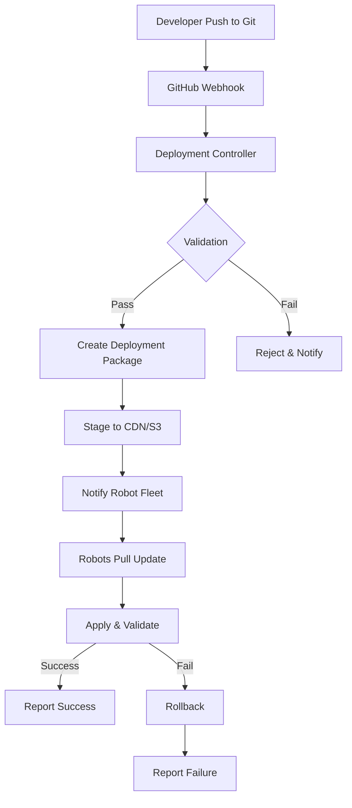

# LeKiwi Automated Deployment System
## No More Manual SSH Updates! 🚀

### Problem Statement
- Developers manually SSH into each robot via ZeroTier
- Inconsistent manual code changes across fleet
- No version tracking or rollback capability
- Management nightmare with no audit trail
- Risk of breaking production robots

### Solution Architecture

## 1. Deployment Pipeline Overview



## 2. Core Components

### 2.1 Deployment Agent (Runs on Each Robot)
```python
# /opt/lekiwi/deployment-agent/agent.py
"""
Automated deployment agent that runs on each robot
Polls for updates, applies them safely, and can rollback
"""

Features:
- Git-based deployment with branch selection
- Automatic rollback on failure
- Health checks before/after deployment
- Staged rollout support
- Configuration management
- Service restart handling
```

### 2.2 Deployment Controller (Central Server)
```python
# Central deployment orchestrator
Features:
- Webhook receiver from GitHub
- Deployment package creation
- Version management
- Rollout orchestration
- Fleet-wide deployment tracking
- Approval workflows
```

### 2.3 Deployment Dashboard
- Web UI for deployment management
- Real-time deployment status
- Rollback controls
- Deployment history
- Configuration management

## 3. Deployment Workflow

### Step 1: Code Push
```bash
# Developer pushes to specific branch
git push origin feature/robot-update
```

### Step 2: Automatic Validation
- Linting and syntax checks
- Unit test execution
- Build verification
- Security scanning

### Step 3: Deployment Package Creation
```yaml
# deployment-manifest.yaml
version: 2.1.0
timestamp: 2024-01-15T10:00:00Z
branch: main
commit: abc123def
files:
  - src/navigation/*.py
  - config/robot.yaml
services_to_restart:
  - lekiwi-navigation
  - lekiwi-telemetry
health_checks:
  - endpoint: /health
    expected: 200
rollback_on_failure: true
```

### Step 4: Staged Rollout
```python
# Deployment stages
stages = [
    {"name": "canary", "percentage": 10, "wait": 300},
    {"name": "partial", "percentage": 50, "wait": 600},
    {"name": "full", "percentage": 100, "wait": 0}
]
```

### Step 5: Robot Update Process
1. Agent polls for updates (or receives push notification)
2. Downloads deployment package
3. Validates package signature
4. Creates backup of current code
5. Applies update
6. Runs health checks
7. Reports status back
8. Rollback if needed

## 4. Implementation Plan

### Phase 1: Basic Deployment (Week 1)
- [ ] Git webhook receiver
- [ ] Simple deployment agent
- [ ] Basic rollback mechanism
- [ ] Deployment logging

### Phase 2: Advanced Features (Week 2)
- [ ] Staged rollouts
- [ ] Health checks
- [ ] Configuration management
- [ ] Service orchestration

### Phase 3: Dashboard & Monitoring (Week 3)
- [ ] Web dashboard
- [ ] Real-time status
- [ ] Deployment metrics
- [ ] Alert system

## 5. Security Considerations

### Code Signing
```python
# All deployment packages are signed
signature = sign_package(package, private_key)
verify_signature(package, signature, public_key)
```

### Access Control
- Role-based deployment permissions
- Approval workflows for production
- Audit logging of all actions

### Network Security
- Encrypted communication (TLS)
- VPN-only access (existing ZeroTier)
- Rate limiting on deployments

## 6. Configuration Management

### Robot Configuration
```yaml
# /etc/lekiwi/robot-config.yaml
robot:
  id: lekiwi-001
  group: warehouse
  environment: production
  
deployment:
  auto_update: true
  update_window: "02:00-04:00"
  max_rollback_attempts: 3
  
features:
  navigation: enabled
  telemetry: enabled
  experimental: disabled
```

### Environment-Specific Configs
- Development robots: auto-deploy from dev branch
- Staging robots: manual approval required
- Production robots: staged rollout with health checks

## 7. Rollback Strategy

### Automatic Rollback Triggers
- Health check failures
- Service crash loops
- Performance degradation
- Error rate threshold exceeded

### Rollback Process
```python
def rollback_deployment():
    # 1. Stop affected services
    stop_services(affected_services)
    
    # 2. Restore previous code
    restore_backup(previous_version)
    
    # 3. Restore configuration
    restore_config(previous_config)
    
    # 4. Restart services
    start_services(affected_services)
    
    # 5. Validate rollback
    run_health_checks()
    
    # 6. Report status
    report_rollback_status()
```

## 8. Monitoring & Alerts

### Deployment Metrics
- Deployment success rate
- Average deployment time
- Rollback frequency
- Robot update lag

### Alert Conditions
- Deployment failures
- Rollback triggered
- Robot offline during deployment
- Configuration drift detected

## 9. Emergency Procedures

### Break Glass Access
```bash
# Emergency override for critical fixes
lekiwi-deploy --emergency --force --robot=lekiwi-001
```

### Fleet-Wide Rollback
```bash
# Rollback entire fleet to previous version
lekiwi-deploy --rollback --all --version=2.0.9
```

## 10. Benefits

### For Management
- ✅ Complete visibility of all deployments
- ✅ Consistent code across entire fleet
- ✅ Audit trail of all changes
- ✅ Easy rollback capabilities
- ✅ No more "works on my robot" issues

### For Developers
- ✅ Push code without SSH access
- ✅ Automatic deployment pipeline
- ✅ Fast rollback if issues arise
- ✅ Testing before production
- ✅ Configuration as code

### For Operations
- ✅ Reduced manual intervention
- ✅ Scheduled maintenance windows
- ✅ Staged rollouts reduce risk
- ✅ Health monitoring
- ✅ Automated recovery

## Quick Start Commands

```bash
# Deploy to specific robot
lekiwi-deploy --robot=lekiwi-001 --version=2.1.0

# Deploy to robot group
lekiwi-deploy --group=warehouse --version=2.1.0

# Staged deployment to all
lekiwi-deploy --all --version=2.1.0 --staged

# Rollback specific robot
lekiwi-deploy --robot=lekiwi-001 --rollback

# View deployment status
lekiwi-deploy --status

# View deployment history
lekiwi-deploy --history --robot=lekiwi-001
```

---

**No more SSH tomfoolery! Just push your code and let the system handle the rest! 🎉**