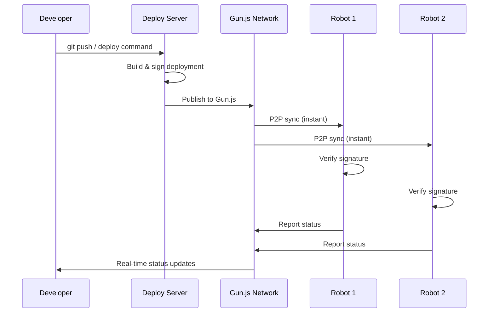

# 🔐 LeKiwi P2P Deployment with Gun.js & Security Layer

## Complete Decentralized & Secure Robot Fleet Management

### Architecture Overview

```
┌─────────────────────────────────────────────────────────────┐
│                    Gun.js P2P Network                        │
│  ┌──────────────────────────────────────────────────────┐  │
│  │         Decentralized Data Synchronization           │  │
│  │  • No single point of failure                        │  │
│  │  • Real-time P2P updates                            │  │
│  │  • Cryptographically signed deployments             │  │
│  └──────────────────────────────────────────────────────┘  │
│                                                              │
│  🤖 Robot Nodes              🖥️ Control Nodes              │
│  ┌─────────────┐            ┌─────────────┐               │
│  │ Lekiwi_001  │◄──────────►│ Deploy Srv  │               │
│  │ • Agent     │            │ • Gun Relay │               │
│  │ • RSA Keys  │            │ • CA Server │               │
│  └─────────────┘            └─────────────┘               │
│         ▲                           ▲                       │
│         │      P2P Gun.js Mesh      │                       │
│         ▼                           ▼                       │
│  ┌─────────────┐            ┌─────────────┐               │
│  │ Lekiwi_002  │◄──────────►│ Dev Machine │               │
│  │ • Agent     │            │ • CLI Tool  │               │
│  │ • RSA Keys  │            │ • Gun Peer  │               │
│  └─────────────┘            └─────────────┘               │
└─────────────────────────────────────────────────────────────┘
```

## 🔑 Security Features

### 1. Cryptographic Identity System

Each robot and server has a unique RSA-2048 keypair:

```python
# Robot Identity
/opt/lekiwi-deploy/certs/
├── Lekiwi_A3F2C8_private.pem  # Robot's private key (never shared)
├── Lekiwi_A3F2C8_public.pem   # Robot's public key
└── Lekiwi_A3F2C8_cert.json    # Certificate signed by server
```

### 2. Deployment Signing & Verification

Every deployment is cryptographically signed:

```python
# Server signs deployment
deployment = {
    'id': 'dep_abc123',
    'version': 'v2.1.0',
    'checksum': 'sha256:...',
    'timestamp': '2024-01-15T10:00:00Z'
}
signature = server_private_key.sign(deployment)

# Robot verifies before applying
if verify_signature(deployment, signature, server_public_key):
    apply_deployment()
else:
    reject_deployment()
```

### 3. Certificate-Based Robot Management

```json
// Robot Certificate
{
    "robot_id": "Lekiwi_A3F2C8",
    "public_key": "-----BEGIN PUBLIC KEY-----...",
    "issued_at": "2024-01-15T10:00:00Z",
    "expires_at": "2025-01-15T10:00:00Z",
    "issuer": "lekiwi-deployment-server",
    "signature": "hex_signature_here"
}
```

### 4. Easy Robot Addition/Removal

#### Add New Robot
```bash
# On new robot
lekiwi-gun register --server https://deploy.lekiwi.io

# Automatic process:
1. Generate RSA keypair
2. Request certificate from server
3. Join Gun.js P2P network
4. Start receiving deployments
```

#### Remove/Revoke Robot
```bash
# From control station
lekiwi-gun revoke Lekiwi_A3F2C8

# Automatic process:
1. Add to revocation list in Gun.js
2. All nodes receive revocation
3. Robot's deployments are rejected
4. Robot removed from fleet
```

## 🌐 Gun.js P2P Benefits

### 1. No Single Point of Failure
- Deployments replicate across all nodes
- Any node can serve deployment data
- Network continues even if server goes down

### 2. Real-Time Synchronization
```javascript
// All robots instantly see new deployments
gun.get('fleet').get('latest').on(deployment => {
    // Triggered on ALL robots simultaneously
    applyDeployment(deployment)
})
```

### 3. Decentralized Command & Control
```javascript
// Send command to specific robot
gun.get('robots').get('Lekiwi_A3F2C8').get('commands').put({
    command: 'rollback',
    version: 'v2.0.9'
})

// Broadcast to all robots
gun.get('fleet').get('broadcast').put({
    command: 'emergency_stop'
})
```

### 4. Offline Resilience
- Robots continue operating when disconnected
- Sync automatically when reconnected
- Local deployment cache for rollbacks

## 🚀 Deployment Flow with Gun.js



## 🔧 Implementation Details

### Gun.js Relay Configuration

```javascript
// gun-relay-config.js
const Gun = require('gun');
require('gun/sea'); // Security, Encryption, Authorization

const gun = Gun({
    peers: [
        'http://relay1.lekiwi.io:8765/gun',
        'http://relay2.lekiwi.io:8765/gun',
        'https://gunjs.herokuapp.com/gun' // Public backup
    ],
    localStorage: false,
    radisk: true, // Persistent storage
    multicast: {
        address: '233.255.255.255',
        port: 8765
    },
    axe: false // Disable unnecessary features
});

// Enable SEA (Security, Encryption, Authorization)
const SEA = Gun.SEA;
```

### Robot P2P Discovery

Robots automatically discover peers via:

1. **Multicast DNS** (local network)
2. **Known relay servers** (internet)
3. **DHT discovery** (distributed hash table)

### Data Structure in Gun.js

```javascript
gun.get('lekiwi-fleet').put({
    deployments: {
        'dep_abc123': {
            id: 'dep_abc123',
            version: 'v2.1.0',
            signature: '...',
            checksum: '...',
            package_url: '...',
            timestamp: '...'
        }
    },
    robots: {
        'Lekiwi_A3F2C8': {
            id: 'Lekiwi_A3F2C8',
            public_key: '...',
            certificate: {...},
            status: {
                version: 'v2.1.0',
                health: 'healthy',
                last_seen: '...'
            }
        }
    },
    latest: {
        all: 'dep_abc123',
        production: 'dep_abc123',
        staging: 'dep_xyz789'
    },
    revoked: {
        'Lekiwi_BAD001': true
    }
});
```

## 🛡️ Security Best Practices

### 1. Key Management
- Private keys never leave the robot
- Public keys distributed via Gun.js
- Server public key pre-installed on robots

### 2. Network Security
- TLS/SSL for Gun.js WebSocket connections
- Optional VPN overlay (WireGuard/Tailscale)
- Firewall rules for Gun.js ports

### 3. Deployment Verification
- SHA256 checksum verification
- RSA signature verification
- Certificate expiry checking
- Revocation list checking

### 4. Access Control
```python
# Role-based permissions
roles = {
    'admin': ['deploy', 'rollback', 'revoke', 'add_robot'],
    'developer': ['deploy', 'rollback'],
    'operator': ['rollback', 'view_status'],
    'viewer': ['view_status']
}

# JWT tokens for API access
token = jwt.encode({
    'user': 'john@lekiwi.io',
    'role': 'developer',
    'exp': datetime.utcnow() + timedelta(hours=24)
}, private_key, algorithm='RS256')
```

## 📊 Monitoring & Observability

### Real-Time Fleet Status
```javascript
// Subscribe to all robot status updates
gun.get('fleet').get('robot_status').map().on((status, robotId) => {
    console.log(`Robot ${robotId}: ${status.health}`);
    updateDashboard(robotId, status);
});
```

### Deployment Metrics
```javascript
// Track deployment success rate
gun.get('fleet').get('metrics').get('deployments').on(metrics => {
    console.log(`Success rate: ${metrics.success_rate}%`);
    console.log(`Average time: ${metrics.avg_time}s`);
    console.log(`Rollback rate: ${metrics.rollback_rate}%`);
});
```

## 🔄 Comparison: Traditional vs Gun.js P2P

| Feature | Traditional (HTTP) | Gun.js P2P |
|---------|-------------------|------------|
| Single Point of Failure | ✅ Yes | ❌ No |
| Real-time Updates | ❌ Polling | ✅ Instant |
| Offline Operation | ❌ Limited | ✅ Full |
| Scalability | 🟡 Server-limited | ✅ Unlimited |
| Network Resilience | ❌ Low | ✅ High |
| Deployment Speed | 🟡 Sequential | ✅ Parallel |
| Security | 🟡 HTTPS | ✅ E2E Encryption |

## 🚦 Quick Start Commands

### Setup Gun.js Network
```bash
# Install Gun.js relay
npm install -g gun
gun --port 8765

# Or use Docker
docker run -p 8765:8765 gundb/gun
```

### Register New Robot
```bash
# On robot
lekiwi-gun register \
  --server https://deploy.lekiwi.io \
  --group production
```

### Deploy via P2P
```bash
# From any node in the network
lekiwi-gun deploy \
  --version v2.1.0 \
  --group production \
  --sign  # Cryptographically sign
```

### Revoke Compromised Robot
```bash
# Immediate network-wide revocation
lekiwi-gun revoke Lekiwi_COMPROMISED \
  --reason "Security breach"
```

### Monitor P2P Network
```bash
# View all connected peers
lekiwi-gun peers

# View deployment propagation
lekiwi-gun watch-deployment dep_abc123
```

## 🎯 Benefits Summary

### Security Benefits
- ✅ **Cryptographic verification** of all deployments
- ✅ **Certificate-based** robot authentication
- ✅ **Easy revocation** of compromised robots
- ✅ **End-to-end encryption** via Gun.js SEA
- ✅ **Tamper-proof** deployment history

### Operational Benefits
- ✅ **No single point of failure**
- ✅ **Works offline** and syncs when connected
- ✅ **Instant updates** across entire fleet
- ✅ **Self-healing** P2P network
- ✅ **Scales infinitely** with more robots

### Management Benefits
- ✅ **Easy robot addition** - just register
- ✅ **Easy robot removal** - just revoke
- ✅ **Real-time visibility** of entire fleet
- ✅ **Decentralized control** from any node
- ✅ **Complete audit trail** in Gun.js

---

## 🔮 Future Enhancements

1. **Gun.js SEA Integration** - Full encryption of deployment data
2. **IPFS Storage** - Distributed package storage
3. **Smart Contracts** - Ethereum-based deployment verification
4. **Zero-Knowledge Proofs** - Privacy-preserving status reports
5. **Mesh Networking** - Direct robot-to-robot communication

---

**Your fleet is now truly decentralized, secure, and unstoppable!** 🚀

No more SSH, no more single points of failure, complete cryptographic security, and instant P2P updates across your entire robot fleet!