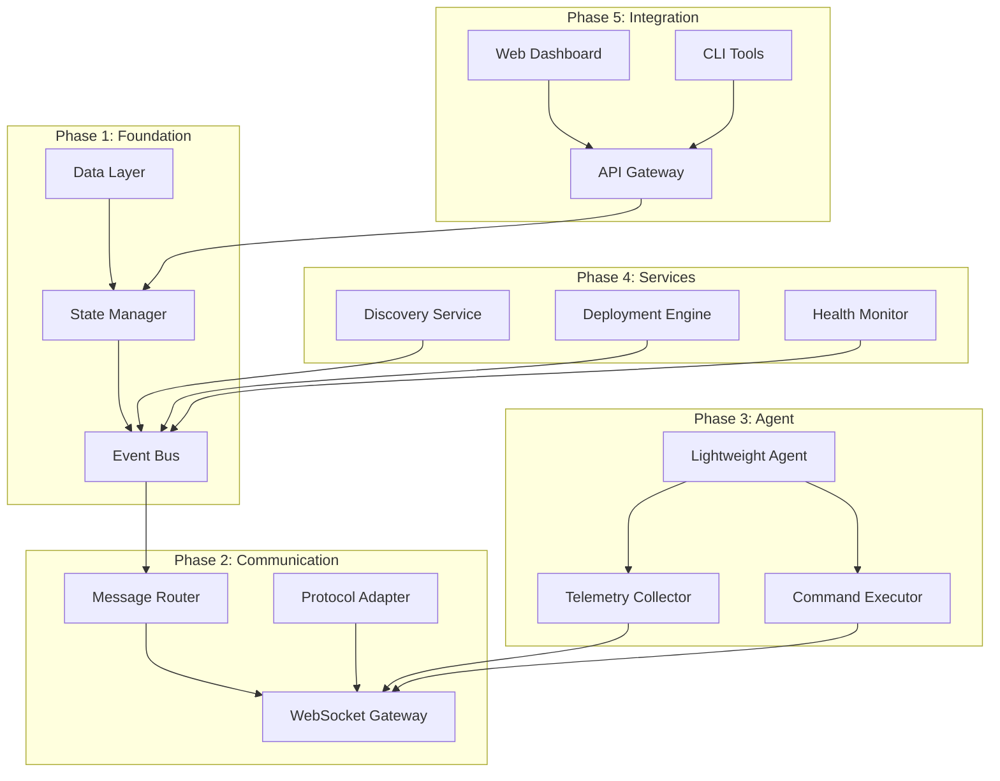

# Modular Refactoring Strategy: LeKiwi Heartbeat System

## Executive Summary

This document defines a phased, modular refactoring strategy to transform the LeKiwi robot deployment system from a polling-based, monolithic architecture to an event-driven, microservices-based system with real-time capabilities and persistent state management.

## Core Principles

1. **Incremental Migration**: Each module can be deployed independently
2. **Backward Compatibility**: Old and new systems coexist during migration
3. **Test-Driven Development**: Every module has test anchors before implementation
4. **Do More With Less**: Minimize resource usage while maximizing functionality
5. **Fail Fast, Recover Quickly**: Built-in resilience and recovery mechanisms

## Module Dependency Graph



## Phase 1: Foundation Layer (Week 1)

### Module 1.1: State Manager

**Purpose**: Single source of truth for all robot and deployment state

**Interface Definition**:
```yaml
StateManager:
  inputs:
    - events: EventStream
    - queries: QueryRequest
  outputs:
    - state: CurrentState
    - snapshots: StateSnapshot
    - projections: QueryResult
  dependencies:
    - PostgreSQL
    - Redis
```

**Pseudocode**:
```python
# State Manager Core Logic
MODULE StateManager:
    INITIALIZE:
        event_store = PostgreSQL.connect()
        cache = Redis.connect()
        snapshots = {}
        
    # TEST: State manager initializes successfully
    # TEST: Can connect to both PostgreSQL and Redis
    
    FUNCTION process_event(event):
        # Validate event schema
        IF NOT validate_event_schema(event):
            RAISE InvalidEventError
            
        # TEST: Invalid events are rejected
        # TEST: Valid events are accepted
        
        # Store event immutably
        event_id = event_store.append(event)
        
        # Update aggregate state
        aggregate = get_or_create_aggregate(event.aggregate_id)
        aggregate.apply(event)
        
        # TEST: Event modifies aggregate state correctly
        # TEST: State changes are idempotent
        
        # Update cache
        cache.set(event.aggregate_id, aggregate.to_dict())
        
        # Check if snapshot needed
        IF aggregate.version % SNAPSHOT_INTERVAL == 0:
            create_snapshot(aggregate)
            
        # TEST: Snapshots created at correct intervals
        # TEST: Can rebuild state from snapshots + events
        
        RETURN event_id
    
    FUNCTION query_state(query):
        # Check cache first
        IF cache.exists(query.aggregate_id):
            RETURN cache.get(query.aggregate_id)
            
        # TEST: Cache hit returns correct data
        # TEST: Cache miss triggers rebuild
        
        # Rebuild from events
        state = rebuild_from_events(query.aggregate_id)
        cache.set(query.aggregate_id, state)
        
        RETURN state
```

### Module 1.2: Event Bus

**Purpose**: Decouple services through asynchronous messaging

**Interface Definition**:
```yaml
EventBus:
  inputs:
    - publish: Event
    - subscribe: TopicPattern
  outputs:
    - events: FilteredEventStream
  dependencies:
    - NATS or RabbitMQ
```

**Pseudocode**:
```python
# Event Bus Implementation
MODULE EventBus:
    INITIALIZE:
        broker = MessageBroker.connect()
        subscriptions = {}
        dead_letter_queue = Queue()
        
    # TEST: Event bus connects to message broker
    # TEST: Can handle connection failures gracefully
    
    FUNCTION publish(event, priority=NORMAL):
        # Add metadata
        event.timestamp = now()
        event.correlation_id = generate_id()
        
        # TEST: Events get proper metadata
        # TEST: Priority affects delivery order
        
        # Route based on priority
        queue = select_queue_by_priority(priority)
        
        TRY:
            broker.publish(queue, event)
            emit_metric("event_published", event.type)
        CATCH PublishError:
            dead_letter_queue.add(event)
            schedule_retry(event)
            
        # TEST: Failed publishes go to DLQ
        # TEST: Retries happen with backoff
        
    FUNCTION subscribe(pattern, handler):
        subscription = broker.subscribe(pattern)
        subscriptions[pattern] = {
            handler: handler,
            subscription: subscription,
            error_count: 0
        }
        
        # TEST: Subscriptions filter correctly
        # TEST: Multiple subscribers can share topic
        
        ASYNC process_messages(subscription):
            WHILE active:
                message = subscription.next()
                TRY:
                    handler(message)
                    message.ack()
                CATCH HandlerError:
                    handle_error(message, error)
                    
        # TEST: Message processing is resilient
        # TEST: Acknowledgments work correctly
```

### Module 1.3: Data Layer

**Purpose**: Abstract database operations and caching

**Interface Definition**:
```yaml
DataLayer:
  inputs:
    - write: WriteRequest
    - read: ReadRequest
  outputs:
    - result: OperationResult
  dependencies:
    - PostgreSQL
    - Redis
    - Connection Pool
```

## Phase 2: Communication Layer (Week 1-2, Parallel)

### Module 2.1: WebSocket Gateway

**Purpose**: Real-time bidirectional communication

**Pseudocode**:
```python
# WebSocket Gateway
MODULE WebSocketGateway:
    INITIALIZE:
        server = WebSocketServer(port=8080)
        connections = ConnectionPool()
        rate_limiter = RateLimiter()
        
    # TEST: Gateway starts on correct port
    # TEST: Can handle 10,000 concurrent connections
    
    FUNCTION handle_connection(socket):
        # Authenticate connection
        auth_token = socket.get_auth_token()
        IF NOT authenticate(auth_token):
            socket.close(401, "Unauthorized")
            RETURN
            
        # TEST: Unauthenticated connections rejected
        # TEST: Valid tokens accepted
        
        # Create connection context
        connection = Connection(
            id=generate_id(),
            socket=socket,
            authenticated_at=now(),
            subscriptions=[]
        )
        
        connections.add(connection)
        
        # TEST: Connection pool manages resources
        # TEST: Connections tracked properly
        
        # Handle messages
        ASYNC WHILE connection.active:
            message = await socket.receive()
            
            IF rate_limiter.exceeds(connection):
                socket.send_error("Rate limit exceeded")
                CONTINUE
                
            # TEST: Rate limiting works per connection
            # TEST: Graceful degradation under load
            
            process_message(connection, message)
    
    FUNCTION broadcast(topic, message):
        # Find all subscribed connections
        targets = connections.filter(
            lambda c: topic in c.subscriptions
        )
        
        # TEST: Broadcast only to subscribed connections
        # TEST: Can handle partial failures
        
        # Send with throttling
        FOR connection IN targets:
            IF connection.throttle_strategy:
                message = apply_throttle(message, connection.throttle_strategy)
            
            TRY:
                connection.socket.send(message)
            CATCH SendError:
                connections.mark_failed(connection)
                
        # TEST: Throttling reduces message rate
        # TEST: Failed connections cleaned up
```

### Module 2.2: Protocol Adapter

**Purpose**: Bridge between old polling and new WebSocket system

**Pseudocode**:
```python
# Protocol Adapter for Backward Compatibility
MODULE ProtocolAdapter:
    INITIALIZE:
        legacy_endpoints = {}
        websocket_gateway = WebSocketGateway()
        cache = TTLCache(60)  # 60 second cache
        
    # TEST: Adapter bridges both protocols
    # TEST: No data loss during protocol conversion
    
    FUNCTION handle_legacy_poll(robot_id, version):
        # Check cache first
        cache_key = f"{robot_id}:{version}"
        IF cache.has(cache_key):
            RETURN cache.get(cache_key)
            
        # TEST: Cache reduces backend calls
        # TEST: Cache invalidation works correctly
        
        # Convert to WebSocket message
        ws_request = {
            type: "check_update",
            robot_id: robot_id,
            version: version
        }
        
        # Get response through new system
        response = websocket_gateway.request_response(ws_request)
        
        # Cache and return
        cache.set(cache_key, response)
        RETURN response
        
    # TEST: Legacy format preserved
    # TEST: Response timing acceptable
```

## Phase 3: Robot Agent (Week 2, Parallel)

### Module 3.1: Lightweight Agent

**Purpose**: Minimal footprint robot-side agent

**Pseudocode**:
```python
# Lightweight Robot Agent (<50MB RAM)
MODULE LightweightAgent:
    INITIALIZE:
        config = load_config("/etc/lekiwi/agent.yml")
        websocket = None
        local_state = SQLite("/var/lib/lekiwi/state.db")
        telemetry_buffer = RingBuffer(1000)
        
    # TEST: Agent uses less than 50MB RAM
    # TEST: Starts successfully on Raspberry Pi
    
    FUNCTION connect():
        WHILE NOT connected:
            TRY:
                websocket = WebSocketClient(config.server)
                websocket.connect(timeout=30)
                send_registration()
                connected = TRUE
            CATCH ConnectionError:
                backoff_time = calculate_backoff()
                sleep(backoff_time)
                
        # TEST: Reconnection with exponential backoff
        # TEST: Registration includes all metadata
    
    FUNCTION heartbeat_loop():
        WHILE running:
            heartbeat = {
                timestamp: now(),
                uptime: get_uptime(),
                memory: get_memory_usage(),
                cpu: get_cpu_usage()
            }
            
            # TEST: Heartbeat sent every 30 seconds
            # TEST: Heartbeat contains required fields
            
            IF websocket.connected:
                websocket.send(heartbeat)
            ELSE:
                local_state.queue(heartbeat)
                
            sleep(30)
            
    FUNCTION telemetry_loop():
        WHILE running:
            # Collect metrics
            metrics = collect_system_metrics()
            
            # Detect changes
            IF significant_change(metrics):
                telemetry_buffer.add(metrics)
                
            # TEST: Only significant changes trigger send
            # TEST: Buffer prevents data loss
            
            # Send batch if buffer threshold reached
            IF telemetry_buffer.size() > BATCH_SIZE:
                send_telemetry_batch()
                
            sleep(1)
            
    FUNCTION detect_teleoperation():
        # Check multiple indicators
        indicators = {
            joy_commands: check_ros_topic("/cmd_vel", 5),
            video_streams: check_port(8554),
            webrtc_peers: check_webrtc_connections(),
            control_latency: measure_command_latency()
        }
        
        # TEST: Detects active teleoperation
        # TEST: No false positives from service state
        
        # Weighted scoring
        score = calculate_teleoperation_score(indicators)
        RETURN score > TELEOPERATION_THRESHOLD
```

### Module 3.2: Telemetry Collector

**Purpose**: Efficient metric collection with minimal overhead

**Pseudocode**:
```python
# Telemetry Collector
MODULE TelemetryCollector:
    INITIALIZE:
        samplers = {
            cpu: CPUSampler(interval=5),
            memory: MemorySampler(interval=10),
            disk: DiskSampler(interval=60),
            network: NetworkSampler(interval=5),
            temperature: TemperatureSampler(interval=30)
        }
        
    # TEST: Samplers run at correct intervals
    # TEST: Collection has minimal CPU impact
    
    FUNCTION collect():
        metrics = {}
        
        FOR name, sampler IN samplers:
            IF sampler.should_sample():
                value = sampler.sample()
                
                # Apply delta compression
                IF sampler.last_value:
                    delta = value - sampler.last_value
                    IF abs(delta) > sampler.threshold:
                        metrics[name] = value
                        sampler.last_value = value
                ELSE:
                    metrics[name] = value
                    sampler.last_value = value
                    
        # TEST: Delta compression reduces data volume
        # TEST: Thresholds prevent noise
        
        RETURN metrics
```

## Phase 4: Core Services (Week 2-3)

### Module 4.1: Discovery Service

**Purpose**: Fast, parallel robot discovery

**Pseudocode**:
```python
# Discovery Service
MODULE DiscoveryService:
    INITIALIZE:
        mdns = MDNSListener("_lekiwi._tcp")
        scanner = NetworkScanner()
        discovered_robots = Set()
        
    # TEST: Discovers robots within 5 seconds
    # TEST: Handles network changes gracefully
    
    FUNCTION discover():
        # Parallel discovery methods
        futures = [
            async_mdns_discovery(),
            async_arp_scan(),
            async_dhcp_snooping(),
            async_known_ip_probe()
        ]
        
        # TEST: All discovery methods run in parallel
        # TEST: Partial failures don't block discovery
        
        results = await_all(futures, timeout=5)
        
        FOR robot IN flatten(results):
            IF NOT discovered_robots.contains(robot):
                register_robot(robot)
                discovered_robots.add(robot)
                
        # TEST: No duplicate registrations
        # TEST: New robots auto-registered
        
        RETURN discovered_robots
```

### Module 4.2: Deployment Engine

**Purpose**: Intelligent, differential deployments

**Pseudocode**:
```python
# Deployment Engine
MODULE DeploymentEngine:
    INITIALIZE:
        deployment_queue = PriorityQueue()
        active_deployments = {}
        rollback_history = Stack()
        
    # TEST: Deployments complete in under 2 minutes
    # TEST: Can handle 100 parallel deployments
    
    FUNCTION deploy(deployment_request):
        # Calculate deployment plan
        plan = calculate_deployment_plan(deployment_request)
        
        # TEST: Plan includes only changed files
        # TEST: Dependencies resolved correctly
        
        # Pre-deployment health check
        FOR robot IN plan.targets:
            health = check_robot_health(robot)
            IF NOT health.ready_for_deployment:
                plan.exclude(robot)
                log_warning(f"Robot {robot} not ready")
                
        # TEST: Unhealthy robots excluded
        # TEST: Health checks have timeout
        
        # Execute deployment with rollback capability
        deployment_id = generate_id()
        active_deployments[deployment_id] = {
            plan: plan,
            status: "running",
            started_at: now()
        }
        
        TRY:
            # Deploy in batches
            FOR batch IN plan.get_batches():
                batch_results = deploy_batch(batch)
                
                # Check success rate
                success_rate = calculate_success_rate(batch_results)
                IF success_rate < ROLLBACK_THRESHOLD:
                    RAISE DeploymentFailure("Success rate too low")
                    
            # TEST: Batch deployment works
            # TEST: Automatic rollback on failure
            
            active_deployments[deployment_id].status = "completed"
            
        CATCH DeploymentFailure:
            rollback(deployment_id)
            active_deployments[deployment_id].status = "rolled_back"
            
    FUNCTION deploy_batch(batch):
        # Parallel deployment to batch
        futures = []
        
        FOR robot IN batch:
            future = async_deploy_to_robot(robot)
            futures.append(future)
            
        # Wait with timeout
        results = await_all(futures, timeout=120)
        
        # TEST: Parallel deployment works
        # TEST: Individual timeouts don't block batch
        
        RETURN results
```

## Phase 5: Integration Layer (Week 3)

### Module 5.1: API Gateway

**Purpose**: Unified REST/GraphQL API

**Pseudocode**:
```python
# API Gateway
MODULE APIGateway:
    INITIALIZE:
        rest_server = FastAPI()
        graphql_server = GraphQL()
        auth_middleware = AuthMiddleware()
        rate_limiter = RateLimiter()
        
    # TEST: REST and GraphQL endpoints work
    # TEST: Authentication required for all endpoints
    
    FUNCTION handle_request(request):
        # Authentication
        IF NOT auth_middleware.authenticate(request):
            RETURN 401, "Unauthorized"
            
        # Rate limiting
        IF rate_limiter.exceeds(request.user):
            RETURN 429, "Too Many Requests"
            
        # TEST: Rate limiting per user
        # TEST: Proper error codes returned
        
        # Route to appropriate handler
        IF request.is_graphql():
            RETURN graphql_server.handle(request)
        ELSE:
            RETURN rest_server.handle(request)
```

## Implementation Phases

### Phase Breakdown

| Phase | Modules | Duration | Parallel? | Dependencies |
|-------|---------|----------|-----------|--------------|
| 1 | State Manager, Event Bus, Data Layer | Week 1 | Yes | None |
| 2 | WebSocket Gateway, Protocol Adapter | Week 1-2 | Yes | Phase 1 |
| 3 | Lightweight Agent, Telemetry Collector | Week 2 | Yes | Phase 2 |
| 4 | Discovery, Deployment Engine | Week 2-3 | Yes | Phase 1,2 |
| 5 | API Gateway, Web Dashboard | Week 3 | Yes | Phase 1-4 |
| 6 | Migration & Cutover | Week 4 | No | All |

### Parallel Execution Opportunities

1. **Foundation Layer**: All three modules can be developed in parallel
2. **Communication & Agent**: Can be developed simultaneously
3. **Services**: Discovery and Deployment can be parallel
4. **Frontend**: Web Dashboard and CLI can be parallel

## Testing Strategy

### Unit Tests per Module

```python
# Example Test Structure for State Manager
CLASS TestStateManager:
    
    TEST "initializes_with_connections":
        manager = StateManager()
        ASSERT manager.event_store.connected
        ASSERT manager.cache.connected
    
    TEST "processes_valid_events":
        event = create_test_event()
        event_id = manager.process_event(event)
        ASSERT event_id is not None
        
    TEST "rejects_invalid_events":
        invalid_event = {type: "unknown"}
        ASSERT_RAISES InvalidEventError:
            manager.process_event(invalid_event)
            
    TEST "creates_snapshots_at_interval":
        FOR i IN range(SNAPSHOT_INTERVAL + 1):
            manager.process_event(create_test_event())
        ASSERT manager.snapshots.count() == 1
        
    TEST "rebuilds_from_snapshots":
        # Add events
        events = [create_test_event() for _ in range(100)]
        FOR event IN events:
            manager.process_event(event)
            
        # Clear cache
        manager.cache.clear()
        
        # Query should rebuild
        state = manager.query_state(aggregate_id)
        ASSERT state.version == 100
```

### Integration Tests

```python
# Integration Test Example
CLASS TestEndToEnd:
    
    TEST "robot_registration_flow":
        # Start services
        state_manager = StateManager()
        event_bus = EventBus()
        ws_gateway = WebSocketGateway()
        
        # Simulate robot connection
        robot_socket = MockWebSocket()
        ws_gateway.handle_connection(robot_socket)
        
        # Verify registration event
        event = event_bus.get_next_event()
        ASSERT event.type == "RobotRegistered"
        
        # Verify state updated
        state = state_manager.query_state(robot_id)
        ASSERT state.status == "online"
```

## Rollback Plan

### Per-Module Rollback

1. **State Manager**: Keep old database, run dual writes
2. **WebSocket Gateway**: Maintain polling endpoints
3. **Agent**: Deploy alongside old agent, gradual cutover
4. **Services**: Feature flags for new vs old behavior

### Rollback Triggers

- Error rate > 5% for any module
- Response time > 2x baseline
- Memory usage > 1.5x expected
- Deployment success rate < 80%

### Rollback Procedure

```python
PROCEDURE rollback_module(module_name):
    # Stop new module
    systemctl stop lekiwi-{module_name}
    
    # Revert configuration
    cp /etc/lekiwi/{module_name}.conf.backup /etc/lekiwi/{module_name}.conf
    
    # Switch traffic back
    update_load_balancer(module_name, "old")
    
    # Verify old system working
    health_check = check_module_health(f"{module_name}-old")
    IF NOT health_check.passed:
        alert_operators("CRITICAL: Rollback failed")
```

## Success Metrics

### Performance Metrics

| Metric | Current | Target | Measurement |
|--------|---------|--------|-------------|
| Discovery Time | 120s | <5s | Time to find all robots |
| Heartbeat Latency | N/A | <100ms p99 | WebSocket round-trip |
| Deployment Time | 5-10min | <2min | Per robot |
| Agent Memory | 100-200MB | <50MB | RSS memory |
| Concurrent Connections | 10-20 | 10,000 | WebSocket connections |
| State Query Time | 1-5s | <10ms p99 | Database query |

### Reliability Metrics

- **Recovery Time**: <30s after failure
- **Data Loss**: Zero events lost
- **Rollback Success**: 100% successful rollbacks
- **Backward Compatibility**: 100% legacy API support

## Migration Checklist

- [ ] Phase 1: Foundation Layer deployed
- [ ] Phase 2: Communication Layer tested
- [ ] Phase 3: Agent rolled out to 10% of fleet
- [ ] Phase 4: Services integrated
- [ ] Phase 5: API Gateway live
- [ ] Legacy system running in parallel
- [ ] 24-hour soak test passed
- [ ] Rollback tested successfully
- [ ] 50% fleet migrated
- [ ] 100% fleet migrated
- [ ] Legacy system decommissioned
- [ ] Documentation updated
- [ ] Team trained on new system

## Conclusion

This modular refactoring strategy provides a clear path from the current problematic system to a production-grade architecture. By breaking the work into independent modules with clear interfaces, we can:

1. Deploy incrementally with minimal risk
2. Maintain backward compatibility throughout
3. Test thoroughly at each stage
4. Rollback quickly if issues arise
5. Achieve significant performance improvements

The "do more with less" principle is embedded throughout, from the <50MB agent to the efficient delta compression and intelligent caching strategies.