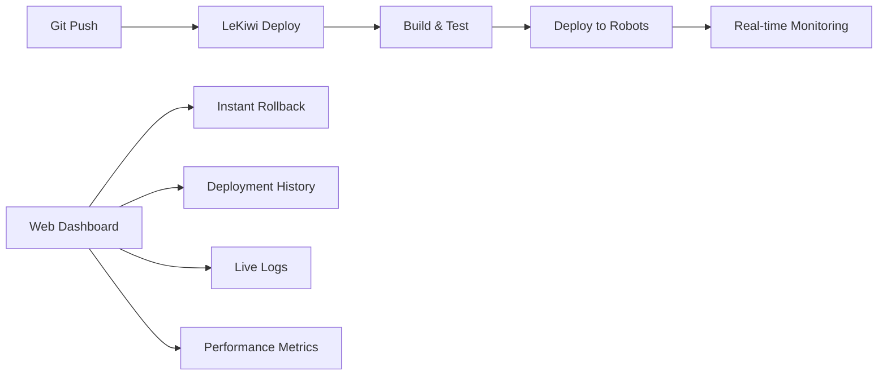

# LeKiwi Deploy - Vercel for Robots 🚀
## Push to Deploy. Instant Rollback. Zero Downtime.

### The Developer Experience You Deserve

```bash
# Push code - robots update instantly
git push

# See deployment in real-time
🔄 Building... 
✅ Deployed to 15 robots in 12 seconds
🌐 Dashboard: https://deploy.lekiwi.io/deployments/dep_2hX9kL3m

# Instant rollback to ANY version
lekiwi rollback --to=3-days-ago
lekiwi rollback --to=v2.1.0
lekiwi rollback --to=commit:abc123
```

## Architecture Overview



## Core Features (Just Like Vercel!)

### 1. Git-Connected Deployments
- **Automatic Deployments**: Every push triggers a deployment
- **Branch Deployments**: Different branches deploy to different robot groups
- **Pull Request Previews**: Test changes on staging robots before merge

### 2. Instant Rollbacks
- **Unlimited History**: Keep last 100 deployments (configurable)
- **One-Click Rollback**: Roll back from dashboard or CLI
- **Time-Based Rollback**: "Roll back to 2 hours ago"
- **Smart Rollback**: Only affected services are rolled back

### 3. Zero-Downtime Deployments
- **Blue-Green Deployment**: Switch between versions instantly
- **Health Checks**: Automatic rollback if health checks fail
- **Gradual Rollout**: Deploy to % of fleet first
- **Instant Revert**: Sub-second rollback

### 4. Real-Time Monitoring
- **Live Deployment Status**: Watch deployments happen in real-time
- **Robot Health Dashboard**: See all robots at a glance
- **Performance Metrics**: CPU, memory, latency tracking
- **Error Tracking**: Instant alerts on deployment issues

## Implementation

### Deployment Agent 2.0 (Vercel-Style)

```python
#!/usr/bin/env python3
# /opt/lekiwi/deploy/agent.py

import os
import sys
import json
import time
import shutil
import asyncio
import aiohttp
import hashlib
import logging
from pathlib import Path
from datetime import datetime, timedelta
from typing import Dict, List, Optional
import subprocess

class LeKiwiDeployAgent:
    """
    Vercel-style deployment agent for robots.
    Manages multiple deployment slots for instant rollback.
    """
    
    def __init__(self):
        self.config = self.load_config()
        self.setup_logging()
        self.robot_id = self.get_robot_id()
        
        # Deployment slots (like Vercel's immutable deployments)
        self.deployment_dir = Path('/opt/lekiwi/deployments')
        self.deployment_dir.mkdir(exist_ok=True)
        
        # Symlink to current active deployment
        self.current_link = Path('/opt/lekiwi/current')
        
        # Keep last 100 deployments for instant rollback
        self.max_deployments = self.config.get('max_deployments', 100)
        
    def get_deployments(self) -> List[Dict]:
        """Get all available deployments"""
        deployments = []
        
        for dep_dir in sorted(self.deployment_dir.iterdir(), reverse=True):
            if dep_dir.is_dir():
                meta_file = dep_dir / 'metadata.json'
                if meta_file.exists():
                    with open(meta_file) as f:
                        metadata = json.load(f)
                        deployments.append({
                            'id': dep_dir.name,
                            'version': metadata['version'],
                            'timestamp': metadata['timestamp'],
                            'commit': metadata.get('commit'),
                            'branch': metadata.get('branch'),
                            'author': metadata.get('author'),
                            'active': self.is_active_deployment(dep_dir.name)
                        })
        
        return deployments
    
    def is_active_deployment(self, deployment_id: str) -> bool:
        """Check if this is the active deployment"""
        if self.current_link.exists():
            return self.current_link.resolve().name == deployment_id
        return False
    
    async def deploy(self, deployment_info: Dict) -> bool:
        """Deploy new version (Vercel-style)"""
        deployment_id = deployment_info['id']
        deployment_path = self.deployment_dir / deployment_id
        
        try:
            self.logger.info(f"🚀 Deploying {deployment_id}")
            
            # 1. Download to new deployment slot
            deployment_path.mkdir(exist_ok=True)
            
            # Download deployment package
            package_path = await self.download_package(
                deployment_info['url'],
                deployment_path / 'package.tar.gz'
            )
            
            # Extract package
            await self.extract_package(package_path, deployment_path / 'code')
            
            # Save metadata
            metadata = {
                'id': deployment_id,
                'version': deployment_info['version'],
                'timestamp': datetime.now().isoformat(),
                'commit': deployment_info.get('commit'),
                'branch': deployment_info.get('branch'),
                'author': deployment_info.get('author'),
                'rollback_to': str(self.current_link.resolve()) if self.current_link.exists() else None
            }
            
            with open(deployment_path / 'metadata.json', 'w') as f:
                json.dump(metadata, f, indent=2)
            
            # 2. Run pre-deployment checks
            if not await self.pre_deployment_checks(deployment_path):
                self.logger.error("Pre-deployment checks failed")
                shutil.rmtree(deployment_path)
                return False
            
            # 3. Atomic switch (zero-downtime)
            await self.switch_deployment(deployment_id)
            
            # 4. Post-deployment validation
            if not await self.post_deployment_checks():
                self.logger.error("Post-deployment checks failed, rolling back")
                await self.instant_rollback()
                return False
            
            # 5. Cleanup old deployments (keep last N)
            self.cleanup_old_deployments()
            
            self.logger.info(f"✅ Successfully deployed {deployment_id}")
            return True
            
        except Exception as e:
            self.logger.error(f"Deployment failed: {e}")
            if deployment_path.exists():
                shutil.rmtree(deployment_path)
            return False
    
    async def switch_deployment(self, deployment_id: str):
        """Atomic switch to new deployment (zero-downtime)"""
        deployment_path = self.deployment_dir / deployment_id
        
        # Prepare new deployment
        await self.prepare_deployment(deployment_path)
        
        # Stop services gracefully
        await self.graceful_stop()
        
        # Atomic symlink switch
        temp_link = Path('/opt/lekiwi/current.tmp')
        temp_link.symlink_to(deployment_path)
        temp_link.replace(self.current_link)
        
        # Start services with new code
        await self.start_services()
    
    async def instant_rollback(self, to_deployment: Optional[str] = None):
        """Instant rollback to previous or specific deployment"""
        
        if to_deployment:
            # Rollback to specific deployment
            target = self.deployment_dir / to_deployment
        else:
            # Rollback to previous deployment
            current_meta = self.get_current_metadata()
            if current_meta and current_meta.get('rollback_to'):
                target = Path(current_meta['rollback_to'])
            else:
                self.logger.error("No previous deployment to rollback to")
                return False
        
        if not target.exists():
            self.logger.error(f"Target deployment {target} not found")
            return False
        
        self.logger.info(f"🔄 Rolling back to {target.name}")
        
        # Atomic switch
        await self.switch_deployment(target.name)
        
        self.logger.info("✅ Rollback completed")
        return True
    
    async def rollback_to_time(self, timestamp: datetime):
        """Rollback to deployment at specific time"""
        deployments = self.get_deployments()
        
        # Find deployment closest to but before timestamp
        for dep in deployments:
            dep_time = datetime.fromisoformat(dep['timestamp'])
            if dep_time <= timestamp:
                return await self.instant_rollback(dep['id'])
        
        self.logger.error(f"No deployment found before {timestamp}")
        return False
    
    async def rollback_to_version(self, version: str):
        """Rollback to specific version"""
        deployments = self.get_deployments()
        
        for dep in deployments:
            if dep['version'] == version:
                return await self.instant_rollback(dep['id'])
        
        self.logger.error(f"Version {version} not found")
        return False
    
    def cleanup_old_deployments(self):
        """Remove old deployments, keeping last N"""
        deployments = sorted(
            [d for d in self.deployment_dir.iterdir() if d.is_dir()],
            key=lambda x: x.stat().st_mtime,
            reverse=True
        )
        
        # Keep current + last N deployments
        to_keep = set()
        if self.current_link.exists():
            to_keep.add(self.current_link.resolve())
        
        for dep in deployments[:self.max_deployments]:
            to_keep.add(dep)
        
        # Remove old ones
        for dep in deployments:
            if dep not in to_keep:
                self.logger.info(f"Removing old deployment {dep.name}")
                shutil.rmtree(dep)
    
    async def stream_logs(self):
        """Stream deployment logs to server (like Vercel's real-time logs)"""
        async with aiohttp.ClientSession() as session:
            ws = await session.ws_connect(f"{self.config['server']}/ws/logs")
            
            # Stream logs in real-time
            async for line in self.tail_logs():
                await ws.send_json({
                    'robot_id': self.robot_id,
                    'timestamp': datetime.now().isoformat(),
                    'message': line
                })

# CLI Tool (like Vercel CLI)
class LeKiwiCLI:
    """
    Command-line interface for LeKiwi deployments
    """
    
    def __init__(self):
        self.api_url = os.environ.get('LEKIWI_API', 'https://deploy.lekiwi.io')
        self.token = self.load_token()
    
    def deploy(self, path: str = '.'):
        """Deploy current directory"""
        print("🚀 Deploying to LeKiwi fleet...")
        
        # Create deployment package
        package = self.create_package(path)
        
        # Upload to deployment server
        response = self.upload_package(package)
        
        # Stream deployment progress
        self.stream_progress(response['deployment_id'])
    
    def rollback(self, to: str):
        """Rollback to specific version/time/commit"""
        
        if to.startswith('v'):
            # Version rollback
            self.api_call('POST', '/rollback/version', {'version': to})
            
        elif 'ago' in to:
            # Time-based rollback (e.g., "2-hours-ago")
            self.api_call('POST', '/rollback/time', {'time': to})
            
        elif to.startswith('commit:'):
            # Commit-based rollback
            commit = to.replace('commit:', '')
            self.api_call('POST', '/rollback/commit', {'commit': commit})
            
        else:
            # Deployment ID rollback
            self.api_call('POST', '/rollback/deployment', {'id': to})
    
    def list_deployments(self):
        """List all deployments"""
        deployments = self.api_call('GET', '/deployments')
        
        print("📦 Recent Deployments:")
        print("-" * 60)
        
        for dep in deployments[:20]:
            status = "✅" if dep['active'] else "  "
            print(f"{status} {dep['id'][:8]} | {dep['version']} | {dep['timestamp']} | {dep['author']}")
    
    def logs(self, robot_id: Optional[str] = None, follow: bool = False):
        """View deployment logs"""
        if follow:
            # Stream logs in real-time
            self.stream_logs(robot_id)
        else:
            # Get recent logs
            logs = self.api_call('GET', f'/logs/{robot_id}')
            for log in logs:
                print(log)
```

### Web Dashboard (Vercel-Style)

```typescript
// Dashboard UI - Real-time deployment monitoring
import React, { useState, useEffect } from 'react';
import { DeploymentList } from './components/DeploymentList';
import { RobotGrid } from './components/RobotGrid';
import { LogStream } from './components/LogStream';
import { MetricsChart } from './components/MetricsChart';

export const Dashboard: React.FC = () => {
  const [deployments, setDeployments] = useState([]);
  const [activeDeployment, setActiveDeployment] = useState(null);
  const [robots, setRobots] = useState([]);
  
  // Real-time WebSocket connection
  useEffect(() => {
    const ws = new WebSocket('wss://deploy.lekiwi.io/ws');
    
    ws.onmessage = (event) => {
      const data = JSON.parse(event.data);
      
      if (data.type === 'deployment_update') {
        updateDeploymentStatus(data);
      } else if (data.type === 'robot_status') {
        updateRobotStatus(data);
      }
    };
    
    return () => ws.close();
  }, []);
  
  const rollback = async (deploymentId: string) => {
    // One-click rollback
    const confirmed = confirm('Rollback to this deployment?');
    if (confirmed) {
      await fetch('/api/rollback', {
        method: 'POST',
        body: JSON.stringify({ deployment_id: deploymentId })
      });
    }
  };
  
  return (
    <div className="dashboard">
      <header>
        <h1>LeKiwi Deploy</h1>
        <div className="stats">
          <span>🤖 {robots.length} Robots</span>
          <span>📦 {deployments.length} Deployments</span>
          <span>✅ {getHealthyRobots()} Healthy</span>
        </div>
      </header>
      
      <div className="main-grid">
        {/* Deployment Timeline */}
        <section className="deployments">
          <h2>Deployments</h2>
          <DeploymentList 
            deployments={deployments}
            onRollback={rollback}
            onSelect={setActiveDeployment}
          />
        </section>
        
        {/* Robot Status Grid */}
        <section className="robots">
          <h2>Fleet Status</h2>
          <RobotGrid 
            robots={robots}
            deployment={activeDeployment}
          />
        </section>
        
        {/* Real-time Logs */}
        <section className="logs">
          <h2>Live Logs</h2>
          <LogStream deployment={activeDeployment} />
        </section>
        
        {/* Performance Metrics */}
        <section className="metrics">
          <h2>Performance</h2>
          <MetricsChart deployment={activeDeployment} />
        </section>
      </div>
      
      {/* Quick Actions */}
      <div className="quick-actions">
        <button onClick={() => rollback('previous')}>
          ↩️ Rollback to Previous
        </button>
        <button onClick={() => promote('staging', 'production')}>
          🚀 Promote Staging → Production
        </button>
        <button onClick={() => showDeploymentHistory()}>
          📜 View Full History
        </button>
      </div>
    </div>
  );
};
```

### GitHub Integration

```yaml
# .github/workflows/deploy.yml
name: Deploy to LeKiwi Fleet

on:
  push:
    branches: [main, staging, development]
  pull_request:
    types: [opened, synchronize]

jobs:
  deploy:
    runs-on: ubuntu-latest
    
    steps:
      - uses: actions/checkout@v2
      
      - name: Deploy to LeKiwi Fleet
        uses: lekiwi/deploy-action@v1
        with:
          token: ${{ secrets.LEKIWI_TOKEN }}
          
          # Deploy different branches to different robot groups
          target: |
            main: production
            staging: staging-robots
            development: dev-robots
            pr-*: preview-robots
          
          # Run tests before deployment
          pre-deploy: |
            npm test
            npm run lint
          
          # Health checks after deployment
          health-checks:
            - endpoint: /health
              timeout: 30
              
          # Auto-rollback on failure
          auto-rollback: true
```

### CLI Commands (Developer Experience)

```bash
# Install CLI globally
npm install -g @lekiwi/deploy

# Login to your account
lekiwi login

# Deploy current directory
lekiwi deploy
# Output:
# 🚀 Deploying...
# 📦 Creating build... done (2.3s)
# 🔄 Uploading... done (1.2s)
# 🤖 Deploying to 15 robots...
#    ✅ lekiwi-001 (0.8s)
#    ✅ lekiwi-002 (0.9s)
#    ...
# ✨ Deployed successfully in 12.4s
# 🌐 Dashboard: https://deploy.lekiwi.io/dep_2hX9kL3m

# List recent deployments
lekiwi list
# dep_2hX9kL3m  v2.3.1  2 minutes ago    ✅ Active
# dep_8jK4mN9p  v2.3.0  1 hour ago       
# dep_5fG2hL7n  v2.2.9  3 hours ago     

# Instant rollback
lekiwi rollback --to=dep_8jK4mN9p
lekiwi rollback --to=2-hours-ago
lekiwi rollback --to=v2.2.9
lekiwi rollback --to=commit:abc123

# View logs
lekiwi logs --follow
lekiwi logs --robot=lekiwi-001

# Promote deployment
lekiwi promote staging production

# Environment variables
lekiwi env add API_KEY=secret123
lekiwi env list

# Deployment aliases
lekiwi alias production dep_2hX9kL3m
```

## Database Schema (PostgreSQL)

```sql
-- Deployments table (immutable history)
CREATE TABLE deployments (
    id VARCHAR(12) PRIMARY KEY,
    version VARCHAR(50) NOT NULL,
    commit_sha VARCHAR(40),
    branch VARCHAR(100),
    author VARCHAR(255),
    message TEXT,
    created_at TIMESTAMP DEFAULT NOW(),
    package_url TEXT NOT NULL,
    package_hash VARCHAR(64) NOT NULL,
    metadata JSONB,
    status VARCHAR(20) DEFAULT 'pending'
);

-- Robot deployments (track what's deployed where)
CREATE TABLE robot_deployments (
    robot_id VARCHAR(50),
    deployment_id VARCHAR(12),
    deployed_at TIMESTAMP DEFAULT NOW(),
    status VARCHAR(20),
    health_status VARCHAR(20),
    rollback_from VARCHAR(12),
    PRIMARY KEY (robot_id, deployment_id)
);

-- Deployment metrics
CREATE TABLE deployment_metrics (
    deployment_id VARCHAR(12),
    robot_id VARCHAR(50),
    metric_type VARCHAR(50),
    value NUMERIC,
    timestamp TIMESTAMP DEFAULT NOW()
);

-- Keep deployment history forever (or very long)
CREATE INDEX idx_deployments_created ON deployments(created_at DESC);
CREATE INDEX idx_robot_deployments_robot ON robot_deployments(robot_id, deployed_at DESC);
```

## Environment Configuration

```yaml
# Production environment
production:
  auto_deploy: false  # Require manual approval
  health_checks: strict
  rollback_on_error: true
  deployment_window: null  # Deploy anytime
  
# Staging environment  
staging:
  auto_deploy: true  # Auto-deploy from staging branch
  health_checks: normal
  rollback_on_error: true
  
# Development environment
development:
  auto_deploy: true  # Deploy on every push
  health_checks: minimal
  rollback_on_error: false  # Let devs debug
```

## Key Features Summary

### For Developers
- **Git Push = Deploy**: Just like Vercel
- **Instant Rollback**: To any previous version
- **Preview Deployments**: Test PRs on real robots
- **Real-time Logs**: See what's happening
- **Zero Config**: Works out of the box

### For Operations
- **Immutable Deployments**: Every deployment is preserved
- **Atomic Switches**: Zero-downtime deployments
- **Health Monitoring**: Automatic rollback on failures
- **Audit Trail**: Complete deployment history
- **Gradual Rollouts**: Deploy to % of fleet first

### For Management
- **No More SSH**: Developers can't break things
- **Consistent Fleet**: All robots run same code
- **Easy Rollback**: One click to previous version
- **Full Visibility**: See everything in dashboard
- **Cost Effective**: No manual intervention needed

---

**It's literally Vercel, but for your robot fleet! 🚀**

Push code. Robots update. Sleep peacefully. 😴